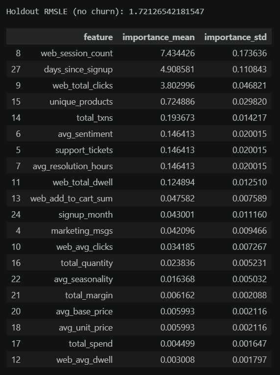
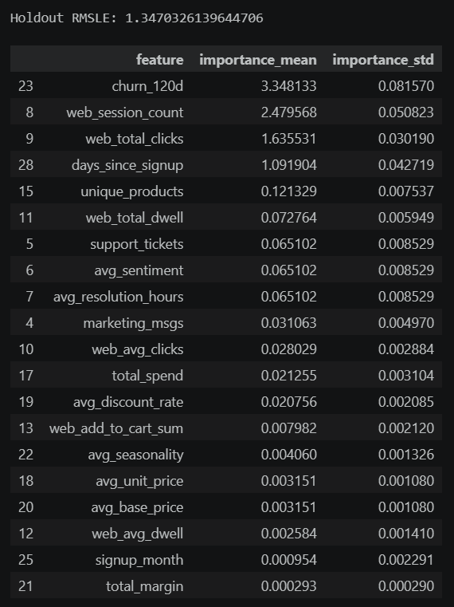

# CSUEB Graduate Capstone Project  
### Customer Lifetime Value Modeling (CLV)

This repository contains my graduate-level capstone project completed at California State University East Bay. The project demonstrates a full end-to-end analytics workflow, including SQL-based data extraction, R-based modeling, exploratory analysis, regression techniques, and business interpretation.

Customer Lifetime Value Modeling — Graduate Capstone Project (CSUEB)

This project served as the culminating experience of my graduate analytics program at California State University East Bay. I designed and implemented a complete end‑to‑end machine learning workflow to estimate Customer Lifetime Value (CLV) using real business data. The work combined SQL data extraction, R‑based modeling, and structured documentation aligned with academic and industry standards.

Project Objectives
Build a predictive model to estimate customer value over time

Identify key behavioral and transactional drivers of CLV

Provide actionable insights to improve retention and marketing efficiency

Deliver a reproducible, well‑documented analytics pipeline

Technical Workflow
1. Data Acquisition & Cleaning

Retrieved raw transactional data using SQL

Performed data cleaning, missing‑value handling, and feature engineering in R

Created modeling‑ready datasets with customer‑level aggregates

2. Exploratory Data Analysis (EDA)

Visualized spending patterns, frequency distributions, and customer segments

Identified outliers and seasonal trends

Used ggplot2 for clear, publication‑quality graphics

3. Model Development

Built regression‑based CLV models using tidymodels

Compared multiple candidate models (linear regression, regularized models)

Evaluated performance using RMSE, MAE, and R²

Selected the best model based on predictive accuracy and interpretability

4. Model Interpretation

Generated feature importance plots

Explained how each variable influenced predicted CLV

Connected statistical findings to business implications

5. Final Deliverables

A complete written report with methodology, results, and recommendations

Reproducible R scripts for data cleaning, modeling, and visualization

A presentation summarizing insights for stakeholders

Key Insights
Customer frequency and average order value were the strongest predictors of CLV

Seasonal purchasing patterns suggested targeted promotional opportunities

High‑value customers showed distinct behavioral signatures that could guide retention strategies

Tools & Technologies
SQL Server — data extraction

R — modeling, visualization, documentation

tidyverse / tidymodels / ggplot2 — analysis and graphics

Markdown — reproducible reporting

Outcome
This project demonstrated my ability to manage a full analytics lifecycle — from raw data to actionable insights — and reinforced my skills in statistical modeling, data engineering, and business communication.

### CLV Forecast Visualization

Below is the forecast output generated from the final model, showing predicted Customer Lifetime Values for the test set.

*Figure 1: Predicted Customer Lifetime Values (CLV) for the test dataset.*

### Feature Importance Visualization

To interpret the model, I analyzed feature importance scores to identify which variables most influenced predicted Customer Lifetime Value (CLV).  
This helps translate statistical results into actionable business insights.

*Figure 2: Top predictors of Customer Lifetime Value (CLV) based on model coefficients.*

---

## 📁 Project Structure

- **assets/** — Visualizations, charts, and diagnostic plots  
- **code/** — SQL and R scripts used for data extraction, cleaning, modeling, and forecasting  
- **presentation/** — Final presentation and written report  

---

## 📬 Contact

If you have questions about this project or would like to discuss the modeling approach, feel free to reach out:

- **Email:** [(zhanglili1004@live.cn)]
- **LinkedIn:** [(https://www.linkedin.com/in/wenhao-zhang-ba783a413/?skipRedirect=true)]
- **GitHub:** [(https://github.com/Wenhao58)]

---

Thank you for reviewing my capstone project. This work reflects my commitment to clear analysis, reproducible workflows, and practical business insights.
